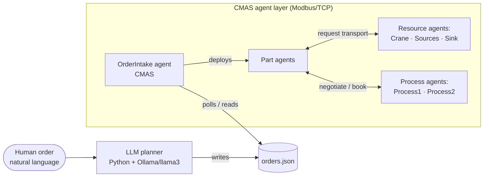

# Architecture

A fully decentralized multi-agent manufacturing cell built in **CMAS 2.14**,
extended with a **Python/Ollama (llama3)** sidecar for natural-language order
intake. Autonomous agents negotiate resources, recover from process failures,
and reconfigure dynamically — with no central controller.

> The hand-drawn design notebook that this document is distilled from lives in
> [`docs/design-notes.md`](docs/design-notes.md). It carries the reasoning and
> the visual intuition behind every decision below.

## Design philosophy

Two ideas run through the whole system:

1. **Separation of concerns.** When one thing in the factory changes, exactly
   one agent should have to change. A new product type → a new part agent. A
   machine moves → only that resource's coordinate changes. A process fails →
   only the part's re-routing logic activates.
2. **Use each tool where it is strong.** CMAS owns what it is good at — agents
   and Modbus. Python owns what *it* is good at — the LLM. The two never reach
   into each other; they communicate through a single file.

## System overview

The system has two cooperating layers joined by one file:



The LLM never speaks Modbus and never calls an agent. It writes `orders.json`;
the OrderIntake agent reads it. The file is the simplest mechanism both sides
can read and write without risk of deadlock.

## Why CMAS

CMAS earns its place for two concrete reasons:

- **Native Modbus binding.** When you create a variable on an agent, you can
  bind it to a Modbus address (e.g. `15` on `127.0.0.1`). From that point CMAS
  handles the whole Modbus loop — connecting, reading, writing, registers — so
  agent logic stays clean.
- **Built-in negotiation through abstract interfaces.** `agreeAndBook()` lets a
  part declare *what* it needs without naming *who* provides it. CMAS acts as
  the broker: broadcast the request, find compatible providers, pick one.
  Reproducing this by hand in Python would mean reinventing service discovery
  and mutual exclusion.

## Agent taxonomy

| Family | Agents | Lifetime | Owns |
|--------|--------|----------|------|
| **Resource** | Crane, Source1/2, Sink | Whole run (one per machine) | Physical equipment and its coordinates |
| **Product** | Part agents | Born on a source, die at the sink | Its process plan and current state |
| **Coordination** | OrderIntake | Whole run | The bridge between the LLM and the agents |

### Resource agents

- **Crane.** Owns the Modbus signals `setX`, `setY` (write target), `vacuum`
  (write grip/release), `posX`, `posY` (read). No other agent reads or writes
  these directly — if an agent needs the crane to act, it asks through the
  crane's transport skill. The transport sequence moves to a safe height
  (`Y=200`) to avoid collisions, traverses in X, descends to pick (`Y=82`),
  grips (`vacuum=1`), lifts, traverses, descends, releases (`vacuum=0`), lifts.
  The crane knows only coordinates — never what a "source", "process", or
  "part type" is.
- **Sources.** Each owns its sensor (detects a part present), its X coordinate,
  and the responsibility to deploy a new part agent when its sensor goes high.
- **Sink.** The simplest agent: it owns only its coordinate. It exists not for
  behaviour but as a location the crane can query — which is exactly what makes
  reconfiguration work.

### Process agents (Process1, Process2)

Each process agent owns:

1. Its **command signals** — `run`, `isRunning`, and a sensor (Modbus).
2. Its **current position** (X coordinate).
3. A **capability descriptor** — the operations it can perform.
   - Process1: `{op1}`
   - Process2: `{op1, op2}`

A part never asks for "Process1". It asks for *any agent that can perform op1*,
and CMAS negotiation finds the matches.

### Product agents (parts)

Each physical part in the simulation has one part agent — the brain that makes
its decisions. A part owns:

1. Its **process plan** — the ordered list of operations it needs.
   - Type-1 part: `[op1]`
   - Type-2 part: `[op1, op2]`
2. Its **state** — where it currently is in that plan.

The plan lives *inside the part agent only* — it is a variable on the part, not
a constant duplicated anywhere else. Part lifecycle: born on a source → look at
the next operation → find a process that can do it (via CMAS negotiation) → ask
the crane to transport it there → wait → ask the process to run → wait for
completion → mark the operation done → repeat; when no operations remain, ask
the crane to move it to the sink.

### Coordination agent (OrderIntake)

The bridge between the LLM and the agent system. Its loop:

1. Check whether `orders.json` exists and has new (pending) content.
2. Parse it.
3. For each order, deploy the appropriate number of part agents at the right
   source — using the **same** `deployByName()` mechanism the source agents use
   for manual generation.
4. Sleep and repeat.

## Coordination and discovery

CMAS discovery works in four pieces:

1. **Interfaces.** Agents do not expose their entire selves — they expose
   interfaces: limited sets of variables and skills. Process1 exposes an
   interface (e.g. `ifProcess`) through which other agents can *read* a
   variable (its current X) and *call* a skill (`runProcess()`).
2. **Abstract interfaces.** A part declares an abstract interface — "I need an
   `ifProcess`; I don't care which agent provides it; find me one."
3. **Negotiation.** For each agent that provides the interface, CMAS calls that
   agent's `onNegotiation()`. The agent answers accept (`1`, "I'm available")
   or refuse (`-1`), and may expose a bid variable.
4. **Booking (mutual exclusion).** CMAS picks one provider and locks the
   connection. While locked, no other agent can use that interface until it is
   released.

`agreeAndBook()` blocks and retries until something becomes free;
`onNegotiation()` answers once. If two parts want Process1, part A books it and
part B's call blocks until part A calls `unbook()` — so there is no deadlock and
no double-booking.

## Failure recovery

When a chosen process fails, only the part's re-routing logic activates — no
other agent is affected. A `runFailed` boolean on the process interface signals
the failure; the part's run logic (`RunProcess1` / `RunProcess2`) detects it,
saves the in-progress coordinates (`savedX` / `savedY`), and re-enters
negotiation to find an alternative provider for the same operation. Because the
part asked for a *capability* rather than a specific agent, an alternative
(e.g. Process2 also offers `op1`) can be selected transparently.

## LLM planner extension

The LLM translates human language into a structured order the agent system can
execute, then gets out of the way.

**Pipeline (Python component):**

1. Read a natural-language order from the user (the prompt/command).
2. Send it to llama3 running locally via Ollama.
3. Validate the response against the expected JSON schema — correct keys,
   correct types, sensible values. Retry on invalid output.
4. On success, write `orders.json`.

**`orders.json` schema:**

```json
{
  "orders": [
    { "type": 1, "count": 3 },
    { "type": 2, "count": 8 }
  ]
}
```

The OrderIntake agent then picks this up and deploys the part agents. A plain
JSON file is deliberate: it is the simplest mechanism both a Python process and
a CMAS agent can read and write, with no shared in-memory state to deadlock or
crash, and it is human-inspectable (open it in any editor to see exactly what
the LLM produced).

## Requirements coverage

> ⚠️ **Check the R-numbering against your assignment spec before publishing.**
> The grade tiers below match the project as built; the handwritten notes use
> R-labels for *design principles* that may not line up one-to-one with the
> spec's requirement numbers. Confirm before committing the exact labels.

| Grade tier | Capability | How it is achieved |
|------------|-----------|--------------------|
| **C** | Single- and dual-product routing | Crane handles only coordinates; the part owns its plan; the process owns operation logic; no agent shares this knowledge. A new product type is a new part agent with a different plan — nothing in the crane changes, because the crane never sees a part type. |
| **C** | Plug & Produce reconfigurability | Each resource agent owns its own X coordinate. The crane asks the bound resource for its location instead of using hard-coded coordinates, so swapping coordinates reconfigures the cell. |
| **B** | Process failure recovery | `runFailed` boolean + re-routing in the part's run logic (`savedX`/`savedY`); the part re-negotiates for any agent offering the same capability. |
| **A** | LLM order intake | The OrderIntake agent consumes JSON; the LLM never touches the agents. Natural-language orders are translated, validated, and written to `orders.json`. |

## Risks and mitigations

- **Collision.** Two parts could drive the crane to the same place. Mitigated by
  the book/unbook discipline: once part A calls `unbook()` on a process, part B
  can book it — the lock serialises access.
- **Timing of process completion.** Assuming an operation is done too early
  corrupts the sequence. Mitigated by polling `isRunning` until it returns to
  `0` before continuing.

## Repository layout

```
.
├── ARCHITECTURE.md          # this document
├── README.md
├── cmas_project/            # CMAS 2.14 agents, abstract interfaces, skills
├── llm_sidecar/             # Python + Ollama planner (writes orders.json)
└── docs/
    ├── design-notes.md      # hand-drawn concept sketches
    └── notes-images/        # rasterised notebook pages
```

## Running the system

Startup order matters:

1. Run the config loader (`config_loader.py`) **before** opening CMAS.
2. Start `Simulation.exe` **first**, then start CMAS.
3. In CMAS Preferences, set `ACLTimeOut` to `100000` (negotiation/booking can
   otherwise time out before a provider frees up).
4. Start the LLM sidecar in `llm_sidecar/` to accept natural-language orders.
