# Design Notebook — Hand-Drawn Concept Sketches

These are my original working notes for the MUA600 multi-agent manufacturing
cell. They walk through the system the way I reasoned about it while building
it — the colours and figures carry the intuition behind each design decision.

For the clean, typed version of the architecture, see
[`../ARCHITECTURE.md`](../ARCHITECTURE.md). These notes are the *why* and the
mental model; the architecture doc is the *what* and the *how*.

> These are informal hand-written notes, kept as-is on purpose. The diagrams
> are the point.

## Contents

1. [Section 1 — Foundations: Modbus, frameworks, and the hybrid approach](#section-1--foundations)
2. [Section 2 — Agents and responsibilities](#section-2--agents-and-responsibilities)
3. [Section 3 — How agents discover and talk to each other](#section-3--how-agents-discover-and-talk-to-each-other)
4. [Section 4 — Failure recovery and negotiation](#section-4--failure-recovery-and-negotiation)
5. [Section 5 — The LLM planner extension](#section-5--the-llm-planner-extension)
6. [Section 7 — Risks](#section-7--risks)

---

## Section 1 — Foundations

Modbus as the device-level "brain", Modbus/TCP for transport over the network,
the framework as the "skull" that manages agent lifecycles, and abstract
interfaces as the contract that lets agents speak a common command vocabulary.
It closes by motivating the chosen **hybrid** design: CMAS agents for the
real-time control, plus an LLM planner for natural-language order intake — and
why CMAS earns its place (native Modbus binding per variable, built-in
negotiation through abstract interfaces).

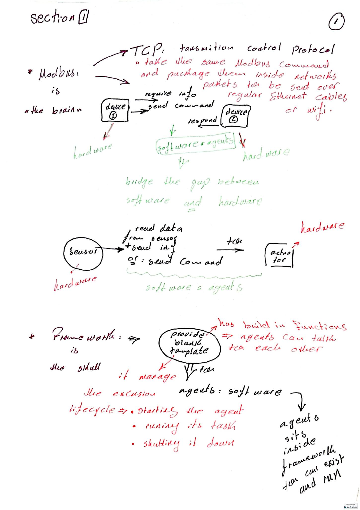

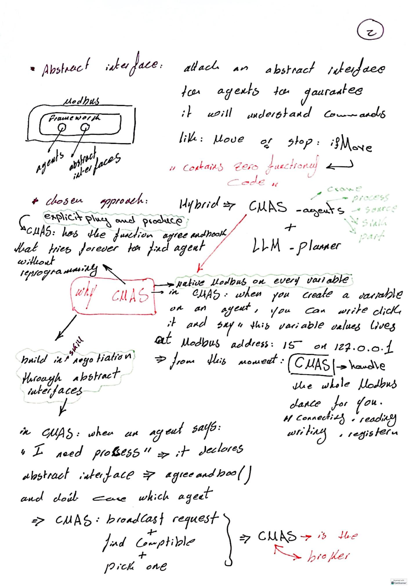

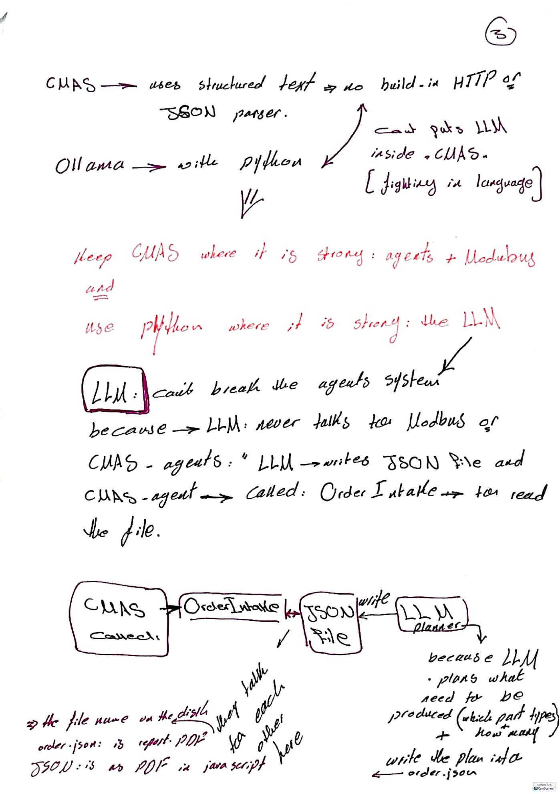

---

## Section 2 — Agents and responsibilities

The separation principle: when something in the factory changes, only one agent
should need to change. This drives the taxonomy — **resource agents** (the
crane, sources, the sink: physical equipment, one per machine, alive for the
whole run), **product agents** (parts: born on a source, die at the sink), and
the **coordination agent** (OrderIntake). It details exactly what each agent
owns, including the crane's Modbus signals and transport skill, the process
agents' capability descriptors, and the part lifecycle.

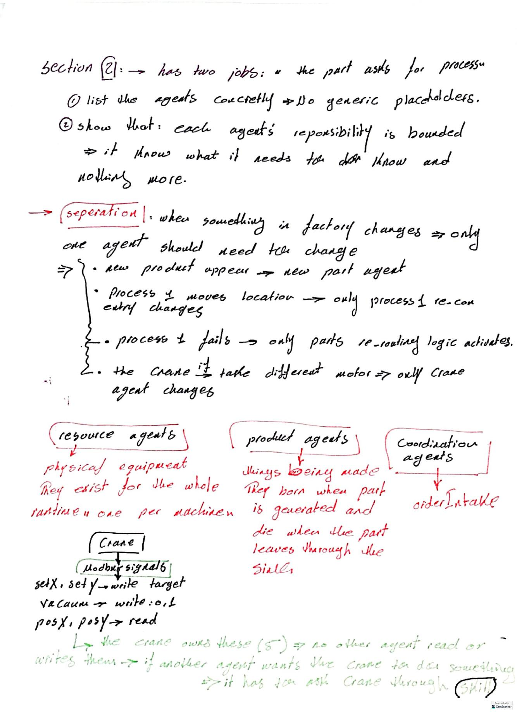

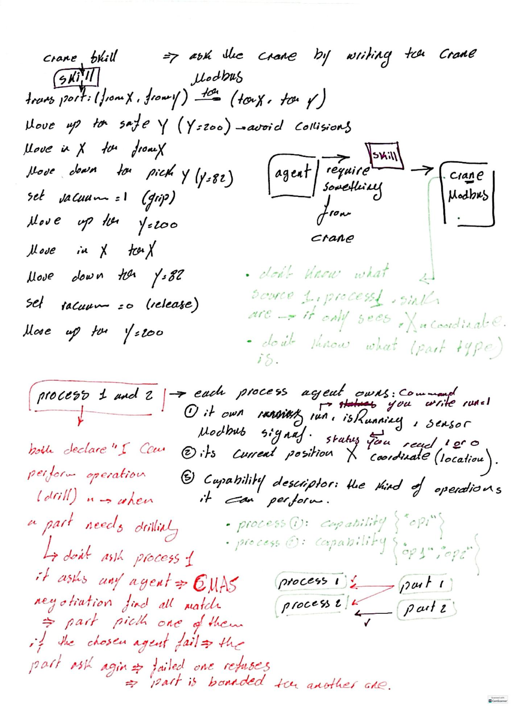

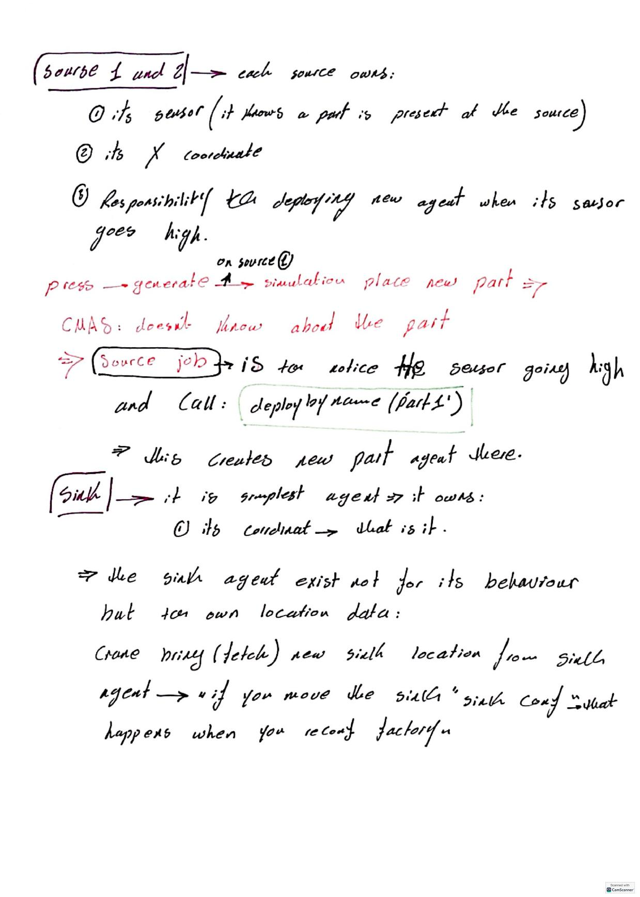

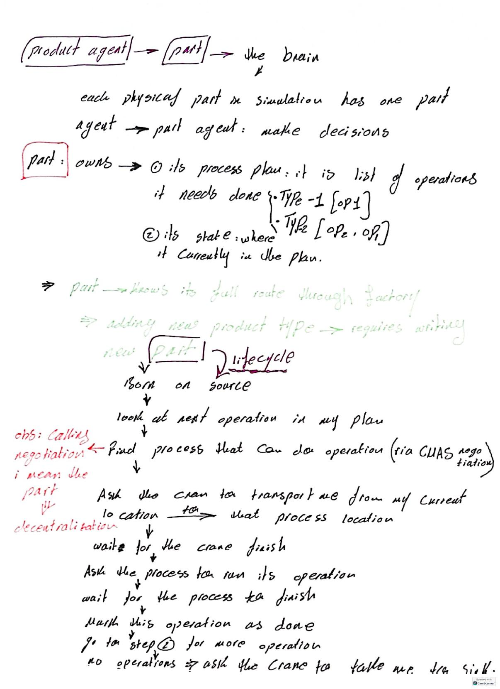

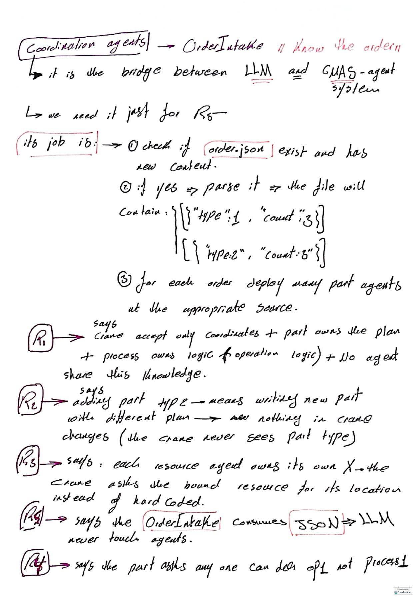

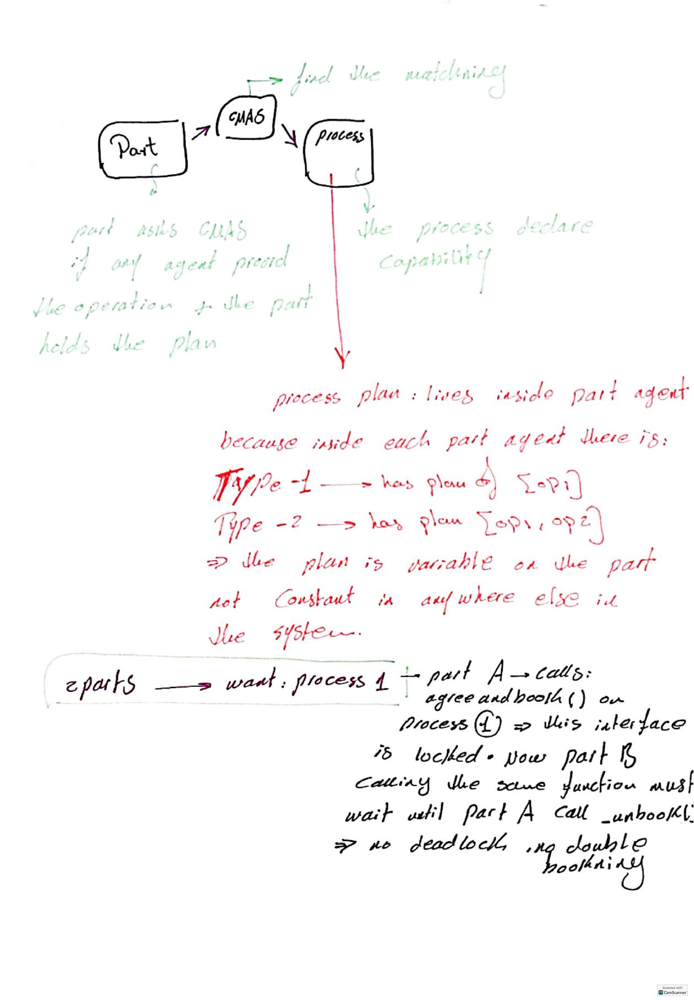

---

## Section 3 — How agents discover and talk to each other

The mechanics of "a part asking for a process". CMAS discovery in four pieces:
**interfaces** (agents expose limited sets of variables and skills, not their
whole selves), **abstract interfaces** (a part declares "I need an `ifProcess`,
I don't care who provides it"), **capability-based discovery**, and
**`agreeAndBook()`**. Then the booking flow as mutual exclusion: search →
negotiate (`onNegotiation()` returns accept/refuse) → pick and lock → return a
handle → release with `unbook()`.

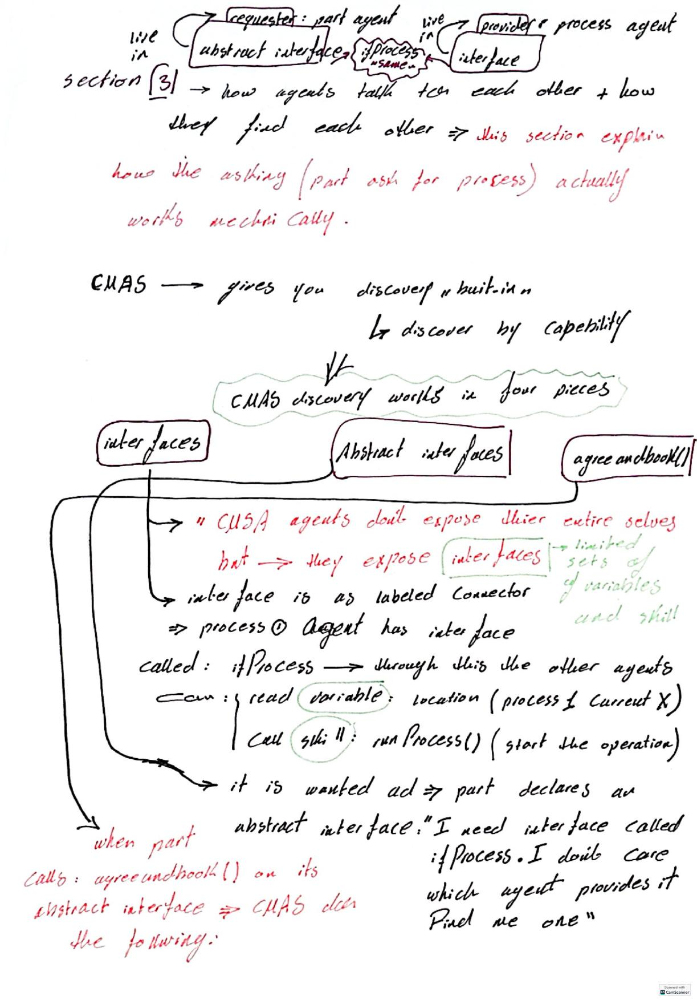

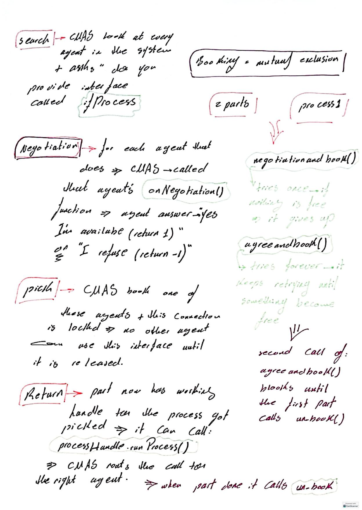

---

## Section 4 — Failure recovery and negotiation

If process 1 fails, who decides process 2 is the right alternative? Negotiation
framed as letting providers compete or veto: a Call-For-Proposals
(`agreeAndBook()` on the abstract `ifProcess`), each candidate's
`onNegotiation()` returning accept (1) or refuse (-1) plus a bid, and CMAS
picking based on availability and bid before the part runs the operation.

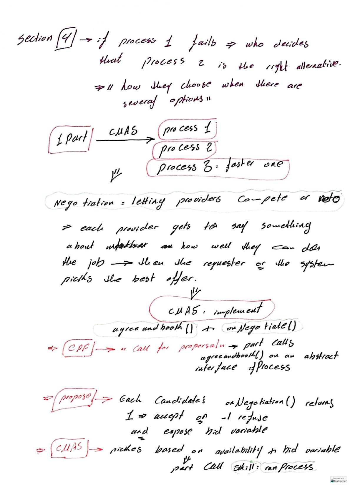

---

## Section 5 — The LLM planner extension

The LLM translates human language into structured data the rest of the system
can consume, without ever touching Modbus or the CMAS agents directly. The
pipeline: read a natural-language order → send to llama3 running locally via
Ollama → validate the JSON response against the expected schema (retry if
invalid) → write `orders.json`. A plain file is the simplest deadlock-free
bridge both sides can read and write. The OrderIntake CMAS agent then polls the
file and deploys part agents.

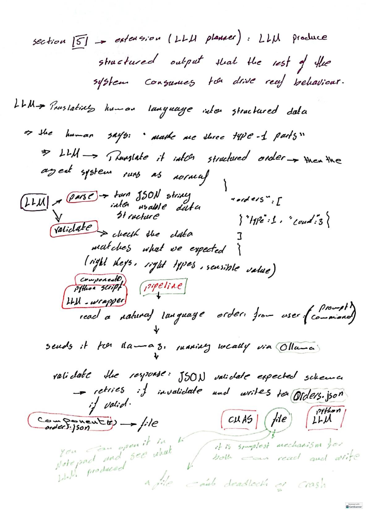

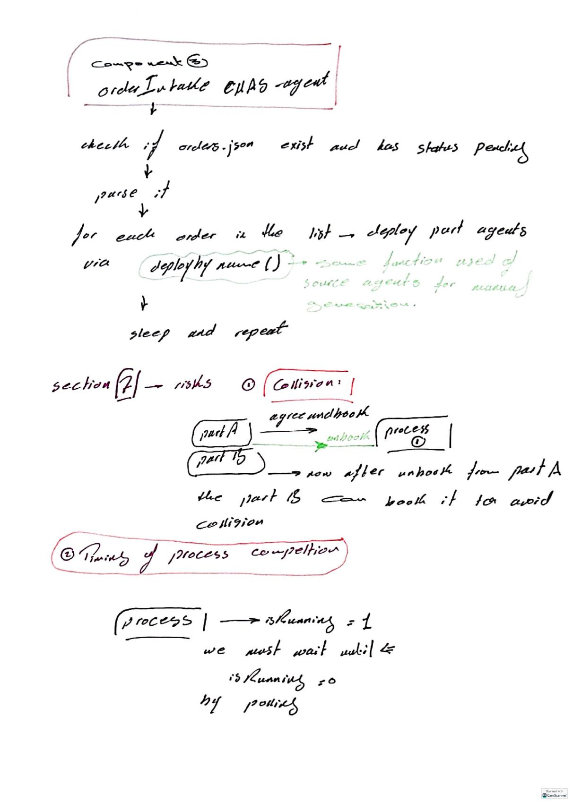

---

## Section 7 — Risks

Covered on the lower half of [page 14](#section-5--the-llm-planner-extension)
above: **collision avoidance** (handled by the book/unbook discipline — once
part A unbooks the process, part B can book it, so two parts never drive the
crane to the same place at once) and **timing of process completion** (poll
`isRunning` until it returns to 0 rather than assuming the operation is done).
